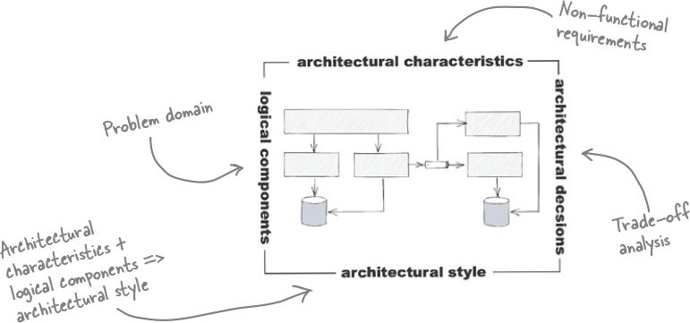
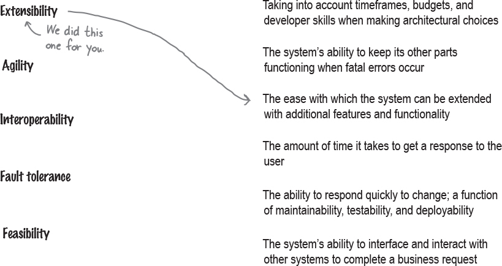
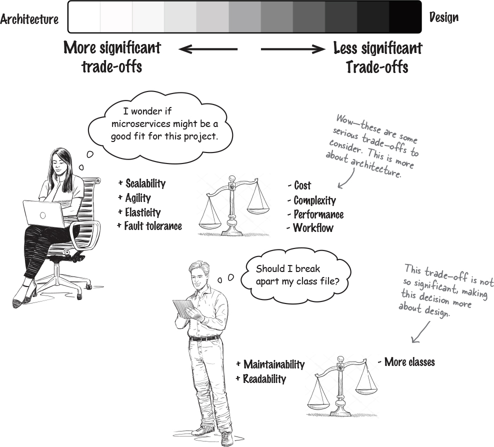

## The dimensions of software architecture

- Architectural characteristics

  This dimension describes what aspects of the system the architecture needs to support—things like scalability, testability, availability, and so on.

  Architectural characteristics are capabilities that are critical or important to the success of the system.

  

- Architectural decisions

  This dimension includes important decisions that have long-term or significant implications for the system—for example, the kind of database it uses, the number of services it has, and how those services communicate with each other.

- Logical components

  This dimension describes the building blocks of the system’s functionality and how they interact with each other. For example, an e-commerce system might have components for inventory management, payment processing, and so on.

- Architectural style

  This dimension defines the overall physical shape and structure of a software system in the same way a building plan defines the overall shape and structure of your home.

## Strategic versus tactical

- How much thought and planning do you need to put into the decision?

  If making the decision takes a couple of minutes to an hour, it’s more tactical in nature. If thought and planning require several days or weeks, it’s likely more strategic (hence more architectural).

- How many people are involved in the decision?

  The more people involved, the more strategic the decision. A decisions you can make by yourself or with a colleague is likely to be tactical. A decision that requires many meetings with lots of stakeholders is probably more strategic.

- Does your decision involve a long-term vision or a short-term action?

  If you are making a quick decision about something that is temporary or likely to change soon, it’s more tactical and hence more about design. Conversely, if this is a decision you’ll be living with for a very long time, it’s more strategic and more about architecture.

